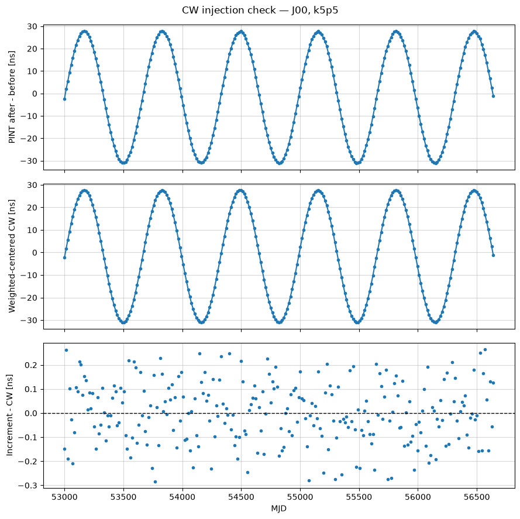

# CW 残差诊断修正与 N522 运行报告

日期：2026-09-03。运行主机：`N522`。环境：项目 `.repro-env`，Python 3.11.15。

## 1. 结果

已修正并分别用全新内核完整执行：

- [02_CW批次注入.ipynb](demo/02_CW批次注入.ipynb)：12 个代码单元，成功执行约 17.5 秒，保存了 2 幅图。
- [04_CW泄漏_PFOS与天空图.ipynb](demo/04_CW泄漏_PFOS与天空图.ipynb)：40 个代码单元，成功执行约 31.4 秒，保存了 11 幅图。

两个 notebook 的残差诊断代码完全一致；原有断言全部通过，没有 error 输出。04 的 PFOS 和当前频率天空图重新计算，101 点 delta 扫描则加载了通过原有一致性检查的缓存，**没有重新计算全部扫描点**。

本次修改的是诊断比较方式，没有修改 CW 波形、注入参数、原始 TOA、计时模型或后续 enterprise 输入。

## 2. 改正点和原因

### 2.1 扣除注入前基线

原代码直接比较 `psr.residuals.time_resids` 与注入 CW，包含了 ideal 基线自身仍有的残差。现在按脉冲星名称匹配基线，重新计算：

\[
\Delta r=r_{\mathrm{after}}-r_{\mathrm{before}}.
\]

本次 J00 重新加载后的基线 RMS 为 **0.304874 ns**，不能假定为严格的零。比较增量可以避免把这部分也归为 CW 注入误差。

### 2.2 统一均值约定

当前模型只有恒定 F0，没有显式 PHOFF。PINT 的 `Residuals` 默认减去加权均值；原代码中的 CW 数组却没有做同样处理。因此新比较采用：

\[
s_\perp=s-\frac{\sum_i w_i s_i}{\sum_i w_i},\qquad
w_i=\sigma_i^{-2},\qquad e=\Delta r-s_\perp.
\]

代码明确传入 `subtract_mean=True, use_weighted_mean=True`，并从 PINT 的 `get_data_error()` 获取同一套权重。这与其官方参数定义一致。[PINT Residuals 文档](https://nanograv-pint.readthedocs.io/en/stable/_autosummary/pint.residuals.Residuals.html)

J00 的 CW 有限采样加权均值为 **+1.6866536556 ns**。因此原差值的均值为 **−1.6866536556 ns**，重现了原图的整体下移。5.5 个周期并不保证采样均值为零；去均值也不要求波形最大值与最小值关于零对称。[PINT 相位零点说明](https://nanograv-pint.readthedocs.io/en/latest/explanation.html#offsets-in-pulsar-timing)

实现还逐点检查了分解恒等式：

\[
r_{\mathrm{after}}-s=e+r_{\mathrm{before}}-\overline{s}_w.
\]

### 2.3 保留 raw 独立检查

另用 `subtract_mean=False` 计算注入前后残差增量，并直接与原始 CW 比较。这条路径保留常数偏置，避免仅以“去均值后误差平均为零”作为通过标准。

诊断同时检查名称、计时模型、TOA 行顺序、信号唯一性和权重一致性；遇到显式 PHOFF 会报出当前方法不适用，而不静默套用去均值公式。

### 2.4 区分 std 与 RMS，重画图

原代码把 `np.std(difference)` 标成 RMS。两者的关系是：

\[
\mathrm{RMS}^2=\mathrm{std}^2+\mathrm{mean}^2
\]

（这里 std 使用 `ddof=0`。）现在分别报告 mean、std、真正的 `sqrt(mean(error**2))` 和最大绝对误差。

新三联图依次显示 PINT 注入增量、加权中心化 CW、二者差值，差值图增加零参考线。没有对差值平滑或强行置零。



## 3. 实测误差

以下均为 J00、当前 `k5p5` 批次，单位 ns：

| 比较方式 | mean | std | 真正 RMS | 最大绝对误差 |
| --- | ---: | ---: | ---: | ---: |
| 原比较：PINT 总残差 − raw CW | −1.686654 | 0.300543 | 1.713221 | 2.464851 |
| 新 raw 增量检查 | 0.012946 | 0.126321 | 0.126983 | 0.277976 |
| 新加权中心化增量检查 | 约 0 | 0.126321 | 0.126321 | 0.283527 |

CW 半峰峰值仍为 **29.300337 ns**。中心化误差 RMS / 中心化信号 RMS 约为 **0.613%**。这表示诊断比较得到改正，不表示改变了原模拟数据或提高了其底层时间精度。

全部 25 颗脉冲星：

- raw：最差 RMS **0.131717 ns**，最大绝对误差 **0.325291 ns**。
- 中心化：最差 RMS **0.131511 ns**，最大绝对误差 **0.320177 ns**。
- 两条路径均满足预定的 RMS < 1 ns、最大绝对误差 < 3 ns；未调整验收阈值。

### 剩余约 0.13 ns 散布的来源

在 J00 的内存副本上，额外比较了三个时间表示层次：

| 独立检查 | RMS [ns] |
| --- | ---: |
| Astropy 双部分 JD 的实际 TOA 位移 − 注入 CW | 0.004398 |
| PINT `tdbld` 时间增量 − 注入 CW | 0.127152 |
| PINT raw 残差增量 − `tdbld` 时间增量 | 0.008356 |

在当前 N522 的 `longdouble` 表示下，MJD 约 53000 处的相邻 `tdbld` 值相隔 **0.306954 ns**。误差在转为这一时间表示后上升到约 0.127 ns，而后续 PINT 残差与该时间增量只差约 0.008 ns RMS。这些对照支持剩余散布主要来自数值时间表示精度，而不是约 1.7 ns 的物理 CW 偏置。它不是另行注入的白噪声。[PINT 时间精度说明](https://nanograv-pint.readthedocs.io/en/latest/explanation.html#precision)

## 4. 验证与数据保护

- notebook JSON/nbformat、全部代码语法、两份诊断源码一致性检查通过。
- 6 组合成测试：零信号、5 周期、5.5 周期，各含等权和不等权采样；另检查常数误差的 std = 0、RMS ≠ 0。
- 6 组真实 PINT 内存测试：同样覆盖零注入、整数/半整数频率及不等权；零注入误差严格为零，其他均通过误差门槛。不等权时普通均值不必为零，中心化使用的是加权均值。
- Fourier 三条计算路径的相对误差分别为单频重构 `3.09e-14`、直接投影 vs F 矩阵 `8.77e-16`、直接投影 vs 采样窗 `1.62e-15`。
- PFOS 数组为 `(10, 300)`，协方差为 `(10, 300, 300)`；DEFIANT 与 MAPS 的脉冲星对顺序相同，响应矩阵为 `(300, 768)`。
- 已有扫描数组 `(101, 10)`、逐对数组 `(101, 10, 300)`、天空图 `(101, 10, 768)` 均通过原有检查，包括 delta = 0.5 与本次单频结果的一致性。
- `demo/cw_batch_data` 中 **234 个原有文件 SHA-256 全部不变**；`03` notebook 和 `cw_intrinsic.py` 保持任务开始时的内容。
- 初始快照记录 313 个文件。完成时 287 个不变，另 26 个属于用户确认同时运行/编辑 01 的变化：01 notebook 和旧 `demo/data/par` 的 25 个文件；这些变化已保留并单独记录，没有恢复或覆盖。后续用户继续运行 01 的旧输出路径也与本任务核心输入分开审计。

详细机器可读证据位于 [validation/cw_residual_20260903](validation/cw_residual_20260903)：运行日志、合成测试、PINT 集成测试、输入哈希、并行修改记录和 DE440 来源/哈希。

## 5. 环境与再次运行

Jupyter 中选择 **Leakage N522 (Python 3.11)**，内核名 `leakage-n522-py311`，解释器为项目 `.repro-env/bin/python`。未修改系统 Python；原来的 Python 3.13 内核条目未被覆盖。

主要版本：PINT 1.1.5、Astropy 7.2.0、NumPy 2.4.6、enterprise-pulsar 3.5.0、healpy 1.19.0、DEFIANT 1.0.1、MAPS 0.4.3。完整 Linux 构建版本保存在 [environment.n522.lock.yml](environment.n522.lock.yml)，其中源码依赖固定为：

- `pta_replicator`：`a2147f7b268b8111290b3c98a9cd416a6e8eaf69`。
- DEFIANT：`7c523e45dc0c27326d24635da5e6686fa3e03b9c`。
- MAPS：`07adb84a29c9c644e67f4f080024b9c774505712`。

原有环境文件未修改。`pip check` 通过。libstempo、MPI、PyMC3 的提示涉及本次未使用的可选功能；本次采用 PINT 和串行 PFOS/radiometer 分析。

初次运行时 NASA 默认 DE440 下载失败，随后通过 NANOGrav 官方镜像缓存了相同的完整 DE440（119799808 字节），没有换成 DE440s 或其他星历。SHA-256：`a4ce9bf9b3282becc9f4b2ac3cebe03a2ae7599981aabd7265fd8482fff7c4b5`。

在项目根目录使用现有环境复验：

```bash
.repro-env/bin/python scripts/validate_cw_notebooks.py test
.repro-env/bin/python scripts/validate_cw_notebooks.py integration
.repro-env/bin/python scripts/validate_cw_notebooks.py execute --notebook 02_CW批次注入.ipynb
.repro-env/bin/python scripts/validate_cw_notebooks.py execute --notebook 04_CW泄漏_PFOS与天空图.ipynb
.repro-env/bin/python scripts/validate_cw_notebooks.py verify
```

需要在同类 Linux 机器复建环境时，用 micromamba 从 `environment.n522.lock.yml` 创建独立前缀，并注册 `leakage-n522-py311` 内核；星历准备命令为 `.repro-env/bin/python scripts/prepare_cw_ephemeris.py`。脚本会访问星历缓存，初次下载需要可达网络。不要覆盖现有环境或替换原始输入哈希快照。

本次验证限定在当前固定计时模型与 CW 配置，未增加完整 timing fit，也不将这些实现检查视作对 PFOS 检测统计或全部物理假设的全面验证。
